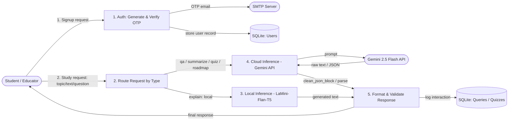

# Data Flow Diagram — EduGenie AI Assistant

## Symbol Legend
| Symbol | Name | Description |
|---|---|---|
| Oval | External Entity | A person or system outside the app (Student/Educator, Gemini API, SMTP Server) |
| Rectangle (numbered) | Process | An activity that transforms data (Validate OTP, Route to AI Engine, Build Quiz JSON) |
| Open rectangle | Data Store | Where data is held (SQLite: Users, Queries, Quizzes tables) |
| Labeled arrow | Data Flow | Movement of data between entities/processes/stores |

## Level-1 DFD

## Process Notes
1. **Auth: Generate & Verify OTP** — handles signup, 6-digit OTP generation, SMTP dispatch, and 10-minute expiry check.
2. **Route Request by Type** — the FastAPI router (`main.py`) decides whether a request goes to the local model or the cloud model.
3. **Local Inference** — `explanation.py` runs `LaMini-Flan-T5-783M` on-device, no external call.
4. **Cloud Inference** — `qna.py`, `summary.py`, `quiz.py`, `learning.py` call the Gemini API.
5. **Format & Validate Response** — strips markdown/JSON fencing (`clean_json_block`), escapes HTML on the client, then returns to the user and logs the interaction to SQLite.
